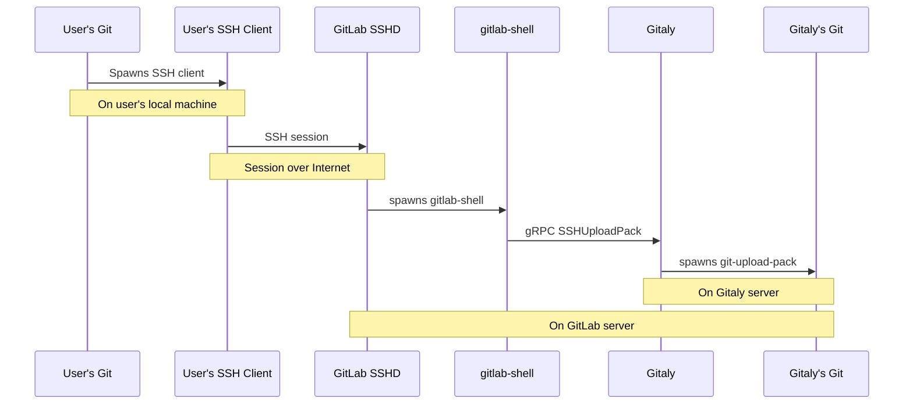

# gitaly-ssh

Gitaly-ssh is a helper executable that enables Git data traffic
(`git fetch`) between Gitaly servers within a single GitLab
installation. It acts as a plugin to `git fetch` using the
`GIT_SSH_COMMAND` environment variable.

The implementation shares code with how GitLab handles Git SSH traffic
from real users, but it cuts out SSH itself.

A normal `git fetch` over SSH goes through these steps. Note that here
`git fetch` runs on the computer of a GitLab user.

```
# Machine of GitLab user
git fetch -(spawn)-> ssh client -(internet)->
  # GitLab server
  sshd -(spawn)-> gitlab-shell -(grpc SSHUploadPack)-> 
    # Gitaly server
    gitaly -(spawn)-> git-upload-pack
```



In contrast, with `gitaly-ssh`, `git fetch` is run by one Gitaly server
('gitaly 1') that wants to fetch data from another ('gitaly 2'). Note
that there is no SSH client or server in this chain.

```
# Gitaly server 1
gitaly -(spawn)-> git fetch -(spawn)-> gitaly-ssh -(grpc SSHUploadPack)->
  # Gitaly server 2
  gitaly 2 -(spawn)-> git-upload-pack
```
