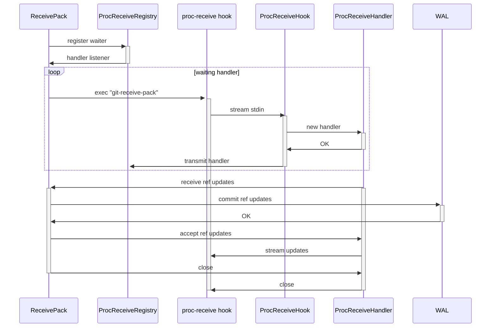
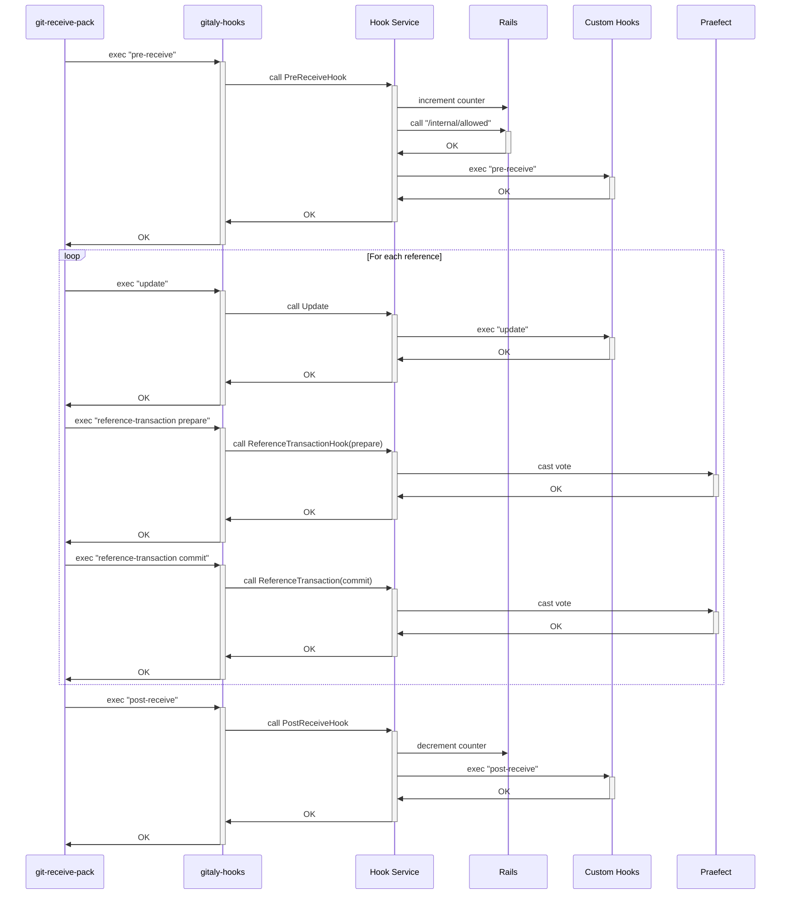
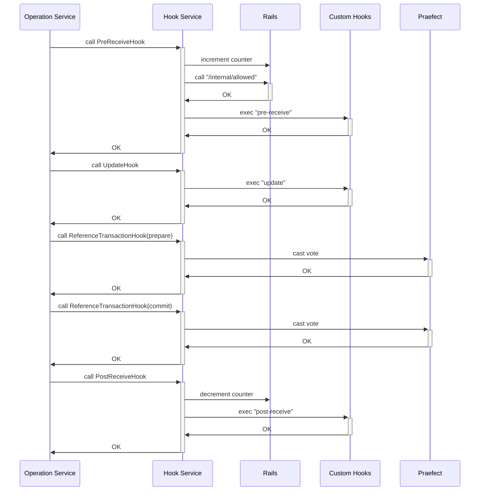

# Gitaly Hooks

Gitaly requires Git to execute hooks after certain mutator RPCs and whenever Git
references are updated. This document explains the different code paths that
trigger hooks.

## Hook Setup

By default, when Git executes hooks, it inspects the `.git/hooks` directory
inside the repository it's executing in. However, Gitaly intercepts this
mechanism. There are no repository-specific hooks we ever want to execute using
this mechanism. Instead, we want to inject our own global hooks that are
required for each repository.

We inject some information into Git commands to set up the hook execution
environment for both Git and ourselves so that the `gitaly-hooks` executable is
able to derive required information:

- We inject the `core.hooksPath` config entry, which points to the directory
  containing our global hooks. Global hooks are set up as a temporary directory
  containing symlinks to a wrapper script which is able to locato the
  `gitaly-hooks` executable.
- We inject `GITALY_HOOKS_PAYLOAD`, which contains JSON-formatted data. This
  payload encodes various information:
  - Which hooks have been requested. Gitaly uses this to only configure a
    subset of hooks even if the executed Git command would run additional
    hooks.
  - Information about the repository the hook is executed in.
  - Information about how to connect to Gitaly.
  - Information about the ongoing transaction, if any.
  - Information about the user who triggered the hook. This is required for
    access checks.

The `gitaly-hooks` executable is only a gateway to be able to use gRPC and
execute the hook logic inside of the Gitaly server process. It uses the injected
information to connect to Gitaly and execute the respective RPC call. The
execution path is:

1. Gitaly symlinks `pre-receive`, `update`, `post-receive`, and
   `reference-transaction` hooks to the `gitaly-hooks` binary from a
   subdirectory of Gitaly's runtime directory.
1. Git locates the hook using `core.hooksPath`.
1. `gitaly-hooks` connects to Gitaly and executes the corresponding RPC call in
   Gitaly, passing along any hook-specific information to the RPC.
1. Gitaly performs the hook-specific logic in the RPC handler.

## `gitaly-hooks` binary

`gitaly-hooks` is a binary that is the single point of entry for Git hooks
through Gitaly.

### Subcommands

`gitaly-hooks` has the following subcommands:

| subcommand     | purpose  | arguments | stdin  |
|----------------|----------|-----------|--------|
| `pre-receive`  | used as the Git `pre-receive` hook | none | `<old-value>` SP `<new-value>` SP `<ref-name>` LF |
| `update`       | used as the Git `update` hook | `<ref-name>` `<old-object>` `<new-object>` | none |
| `post-receive` | used as the Git `post-receive` hook | none | `<old-value>` SP `<new-value>` SP `<ref-name>` LF |
| `reference-transaction` | used as the Git `reference-transaction` hook | `prepared`, `committed`, or `aborted` | `<old-value>` SP `<new-value>` SP `<ref-name>` LF |
| `git`          | used as the Git `pack-objects` hook | `pack-objects` `[--stdout]` `[--shallow-file]` | `<object-list>` |
| `proc-receive` | used as the Git `proc-receive` hook | none | communication with receive-pack in pkt-line format protocol | 

## Hook-specific logic

The logic implemented in Gitaly's hook RPC handlers depends on which hook is
being executed.

### Proc-receive hook

The `git-receive-pack(1)` executes the proc-receive hook for commands that have a
matching prefix with the multi-valued config variable `receive.procReceiveRefs`.
When the variable is set, the hook executes these commands instead of the internal
`execute_commands()` function. This transfers the responsibility of making
reference updates to the hook. The hook executes once for the receive operation.
The hook takes no arguments, but uses a _pkt-line format_ protocol to communicate
with `git-receive-pack(1)` to read commands and push options, and send results.

In Gitaly, we use this mechanism to intercept updates to references made directly
via Git. This hook allows us to capture any updates to references made and route
them through the write-ahead log's write queue. This ensures that we account for
every reference update and log all reference updates.

The write-ahead log eventually will go over the log and commit each transaction where
it will call `git-update-ref(1)` to do the reference update.

#### Implementation details

The `ReceivePack` RPC executes `git-receive-pack(1)` which executes the `proc-receive`
hook via the `gitaly-hook` binary. The hook is independent of the main Gitaly service 
and hence doesn't have access to the WAL.

To overcome this, the `ReceivePack` RPC registers a waiter with the `ProcReceiveRegistry`
against the request's transaction ID. The `proc-receive` hook, when invoked, streams the 
data to the `ProcReceiveHook` RPC. The `ProcReceiveHook` RPC then obtains a new
`ProcReceiveHandler` and transmits the handler to the registry. 

The `ReceivePack` RPC obtains the handler and uses the handler to communicate with the
`ProcReceiveHook` RPC. It obtains the reference updates requests and tries to commit them
to the WAL and relays acceptance/rejections to the `ProcReceiveHook` RPC via the handler.

The `ProcReceiveHook` streams all the data concurrently back to the `proc-receive` hook. 

### Reference-transaction hook

The reference-transaction hook is executed whenever Git updates a reference from
an old value to a new value, where it hooks into the low-level mechanism to
update references in Git. An update of a hook goes through two phases, where the
hook is executed once for each phase:

1. Git "prepares" the reference transaction. When the hook is called in this
   phase, the references that are about to be updated are locked for concurrent
   modification.
1. Git "commits" or "aborts" the reference transaction.

Depending on how the command updates references, this hook can be executed per
reference that is about to be updated, or for all references at once. The
references that are about to be updated are received on standard input.

In Gitaly, we use the reference-transaction mechanism to perform votes on all
references which are updated by Git in a way that is transparent to Gitaly
itself. That is, we do not know how often and with which arguments the hook is
going to be executed when we execute any Git command, and the order can change
when new Git versions are rolled out that do internal changes.

The reference-transaction can therefore be used to put an absolute ordering on
all reference updates across multiple Gitaly nodes. To ensure that multiple
Gitaly nodes part of a single transaction (that is, all Gitalies execute the
same logic at the same point in time) perform the same action, we vote on each
of the hook executions. Gitaly nodes:

1. Take the standard input containing all references we are about to update.
1. Hash these references.
1. Use the resulting hash as it's vote that it sends to Praefect.

We expect the hash must be the same across all Gitaly nodes if (and only if) all
nodes:

- Are in the same state before.
- Make the change deterministically.

If a [quorum](design_ha.md) is reached, the update is committed to disk,
otherwise the update is rejected.

### Receive-Pack Hooks

These hooks are executed by `git-receive-pack` whenever changes are pushed into
a repository and can be used to:

- Verify whether the changes should be allowed into the repository in the first
  place (`pre-receive` and `update` hooks).
- Show information to the user (`post-update` hook).

While the reference-transaction hook executes on all Gitaly nodes, the
receive-pack style hooks only run on a single Gitaly, which is the primary node.
It can thus happen that receive-pack style hooks reject the update on the
primary node, which is not something the secondary nodes would see. The result
is that secondaries would now hang until the timeout for the RPC call triggers
given that the primary is never going to vote on this transaction.

To fix the hang, transactions support graceful stops: if the primary node fails
the RPC call in code that is only executed on the primary, then it will stop the
transaction and thus tell other Gitaly nodes to stop waiting for quorum.

There are two users of these hooks:

- `PostReceivePack` and `SSHReceivePack` directly invoke `git-receive-pack`,
  which then executes the hooks for us.
- Most RPCs in the `OperationService` that write objects into the repository
  manually invoke these hooks using the `updateref.UpdaterWithHooks` structure.

These hooks perform the following functions:

- `pre-receive`: The pre-receive hook receives all reference updates as a whole
  via standard input, where each change is represented by one line with the old
  and new object ID as well the name of the reference that is to be updated. At
  this point, all objects required to satisfy the update have already been
  received, but they are still in a separate "quarantine directory" and are
  therefore detached from the main repository. This hook first increments a
  reference counter that tracks how many pushes are active at the same time.
  Afterwards, it posts all changes to Rails' `/internal/allowed` API endpoint so
  that Rails can determine whether the change is allowed or not. Because objects
  still live in a quarantine directory, Gitaly tells Rails where it can find the
  quarantine directory using the repository's alternative object directory
  fields so that any subsequent RPC calls that check the change can access those
  objects. When the access checks succeed, any existing custom pre-receive hooks
  installed by the administrator are executed.
- `update`: The update hook runs after the pre-receive hook at the point where
  objects from the object quarantine directory have already been migrated into
  the main repository. This hook only executes custom hooks installed by the
  admin.
- `post-receive`: This hook prints information to the user (for example, the
  merge request link). It also decrements the reference counter incremented in
  the pre-receive hook.

Note: The reference is per repository so GitLab knows when a certain repository
can be moved. If the reference counter is not at 0, there are active pushes
happening.

#### Error Messages

Both custom hooks and the `/internal/allowed` API endpoint may return
specially-formatted error messages that have either a `GitLab:` or a
`GL-Hook-Error:` prefix. Messages with this prefix are returned as-is to Rails
and signify an error message that should be printed to the user directly, either
through the user interface or through standard error of `git-receive-pack`.

#### Custom Hooks

Administrators can install custom hooks that run after the usual logic executed
by Gitaly itself. Custom hooks are _never_ expected to replace Gitaly's own
hooks, which are mandatory. Gitaly supports installation of custom hooks for the
`pre-receive`, `update`, and `post-receive` hooks. See the [GitLab server hooks
documentation](https://docs.gitlab.com/ee/administration/server_hooks.html).

## Execution Path

The following sequence diagram depicts the order in which hooks are executed for
`git-receive-pack`-based RPCs:

The following sequence diagram depicts the order in which hooks are executed for
RPCs in the `OperationService`:

